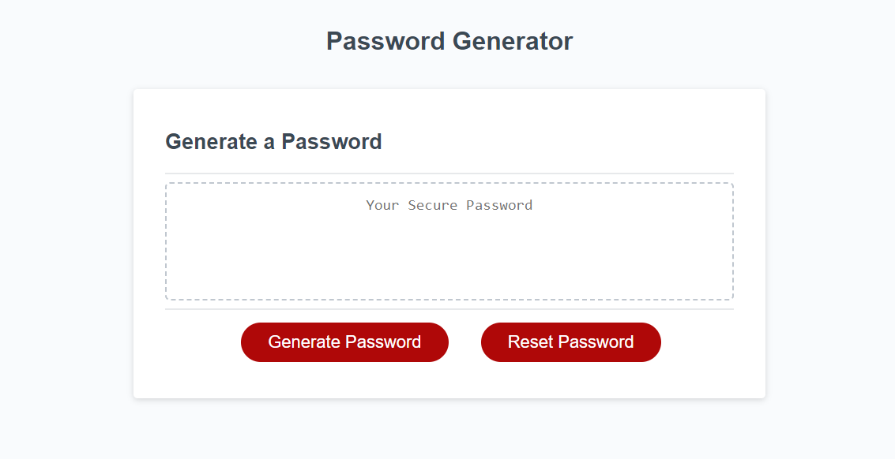

# Random-Password-Generator
Description:

This repo contains a random password generator, which I programmed the JavaScript functionality into.

If the user clicks the "generate password" button, they are prompted to enter a desired password length. If they enter anything other than a number between 8 and 128, they are alerted with correction criteria to force them to select a proper input.

The user is then given a series of confirmations to decide what character types (uppercase, lowercase, number or special characters) they would like their password.

Once all the information is collected, the generator displays a password on screen.

The user then has the option to click the "reset password" button, which will then restart the password generator.

Installation: N/A

Usage: N/A

Credits: Nathan Alexander

License: Please refer to the license in the repo

Badges: N/A

Features: Function buttons to generate and reset password. Options for character types and length designation of password.

How to Contribute: N/A

Tests: N/A

Screenshot:

Deployed Link:
https://nathanalexander1.github.io/Random-Password-Generator/
